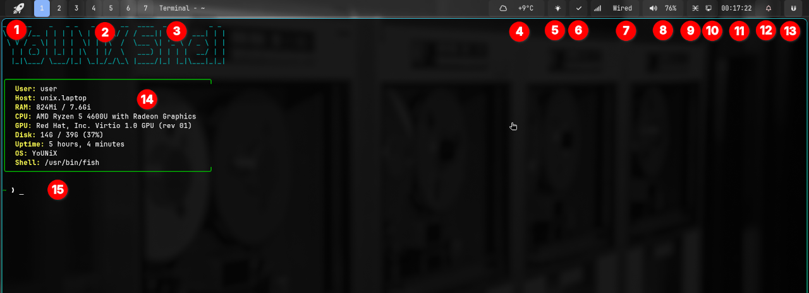
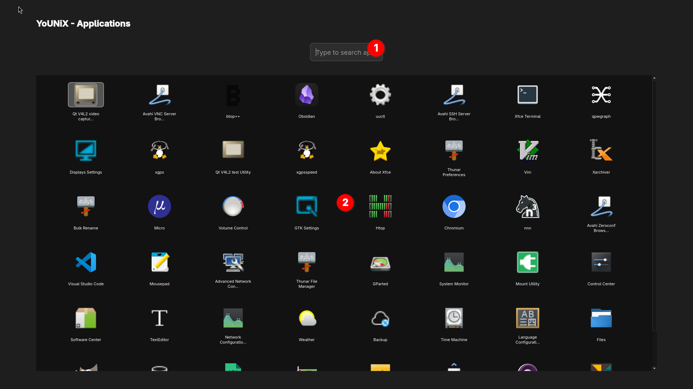
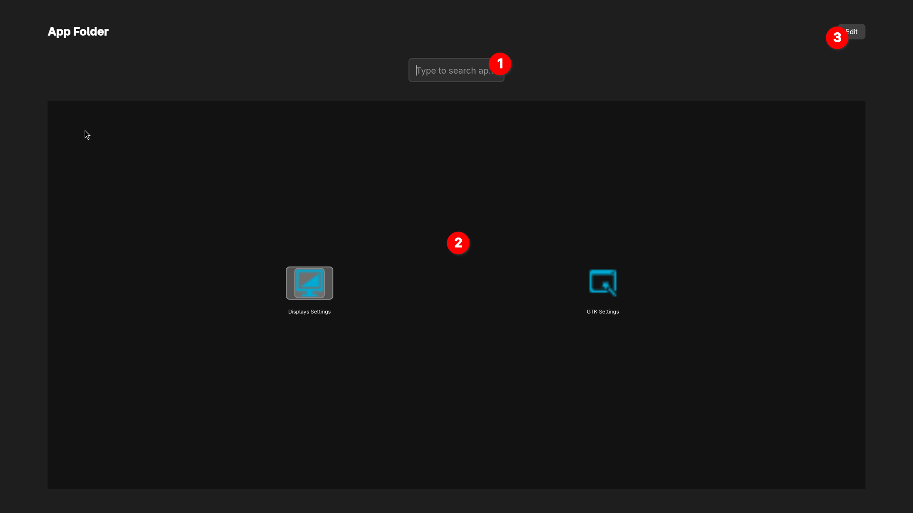
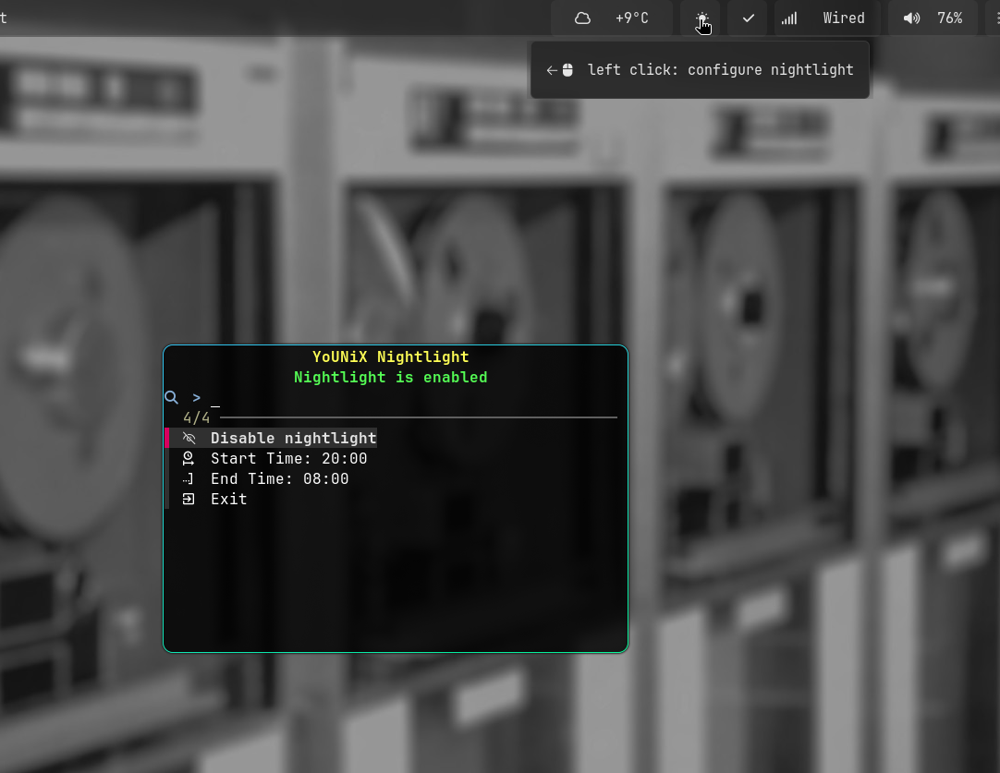
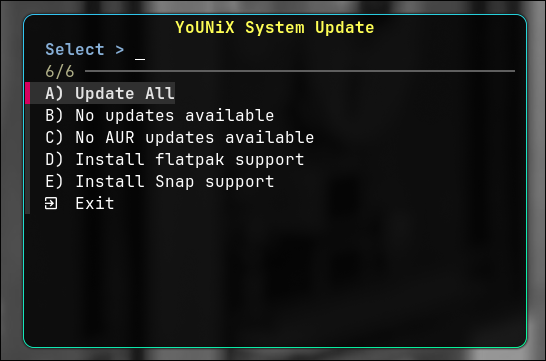
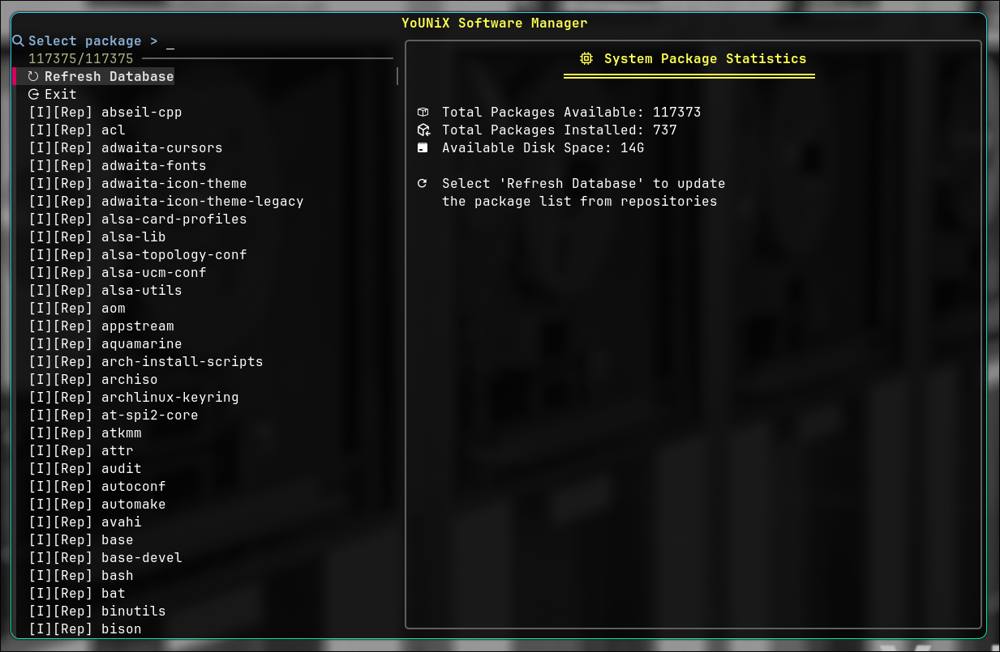

# 1.0 The Desktop

1. Applications
2. Virtual Desktops
3. Active Window/Task-name
4. Weather monitor
5. Nightlight
6. Software Update Status
7. Network Status
8. Sound Volume
9. Audio patch bay
10. Network menu
11. Clock/Calendar
12. Notifications
13. Power Menu
14. Terminal Welcome Message
15. Command Line

## 1. Applications

1. Type here to search into installed applications
2. Application icons.
	- Click an application to start.
	- Click in an empty area or use ESC to close the Applications
	- Drag icons to reorder and organize your applications as you like.
	- Drag an application icon on an other to make a new App Folder.

1. Search into the application folder
2. Folder Applications
	- Drag icons to reorder
	- Drag an icon on top to get it out of the folder
	- Click an icon to start the application.
	- Click in an empty area or use ESC key to close the folder.
3. Default folder name is "App Folder". Use this button to change the folder name.

## 2. Virtual Desktops

- There are seven (7) virtual desktops available.
- Click on a number to jump into it.
- Use the keyboard SUPER+number to change desktop.

## 3. Active Window/Task-name

This is a text line informs you about the active window and the task is working on.

## 4. Weather monitor
This is an indicator for the default city you chose in the **Weather** application. Click on this and the **Weather** app wil rise. Weather app has two panels, the **menu** and the **viewer**.
You can read the manual here.

## 5. Nightlight

Nightlight is enabled by default from 20:00 to 08:00. Click on the icon to configure timing or disable it.

## 6. Software Update Status

Shows weather your system is updated or there are updates available.
- Click on the icon to start the YoUNiX System Update.

- Right Click on the icon to start YoUNiX Software Manager.

